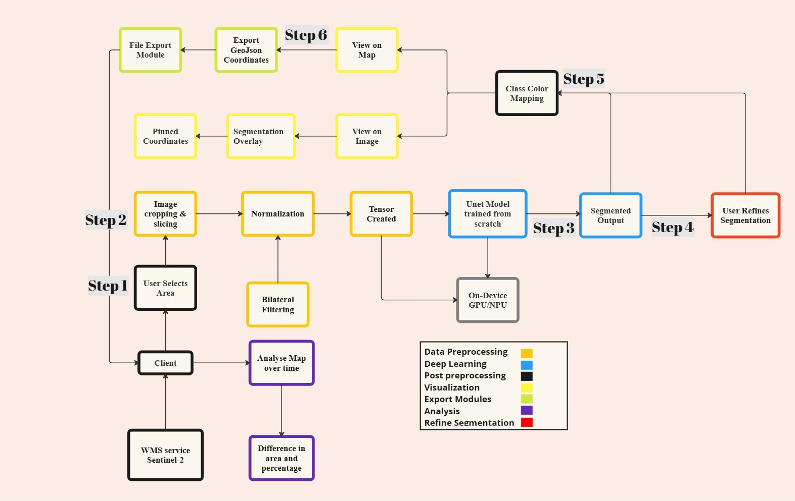

# NakshaGyaan 

##  Introduction
**NakshaGyaan** is a geospatial semantic segmentation tool designed to run directly on a device, enabling **real-time analysis of geospatial imagery** without relying heavily on cloud infrastructure.

Unlike conventional cloud-based solutions—which often suffer from slow response times, high costs, and no offline access, NakshaGyaan offers **fast, resource-friendly, and offline-capable** semantic segmentation for **WMS (Web Map Service)** loaded geospatial images.

---

##  Significance
- **Interactive Geospatial Analysis** made accessible for multiple industries.
- Works efficiently with **limited resources**—ideal for remote areas.
- Useful for **forestry, disaster zones, agriculture, and urban planning**.
  
---

##  Objectives
1. Connect to **WMS services** (e.g., Sentinel-2).
2. Allow **interactive area selection** with tools like the lasso selector.
3. Perform **real-time semantic segmentation** on selected areas.
4. Provide **refined outputs** based on user feedback.
5. Export segmentation results in **GeoJSON** or **KML** formats.

---

##  Tech Stack
- **Frontend:** Next.js, OpenLayers
- **Data Source:** WMS (Sentinel-2)
- **ML Frameworks:** TensorFlow.js, PyTorch, ONNX
- **Formats Supported:** GeoJSON, KML

---

##  Features & User Journey
### 1. Geospatial Data Layers
- Load high-quality imagery from **Sentinel-2 WMS services**.

### 2. Interactive Area Selection
- Select areas with a **lasso tool**.
- Jump directly to specific coordinates.

### 3. Real-Time Semantic Segmentation
- Segment all loaded layers instantly using **on-device ML**.

### 4. Refined Segmentation Views
- View segmented classes **on the image** or **directly on the map**.
- Access **labels** for each segmented class.

### 5. Export Results
- Export segmentation outputs as **GeoJSON** or **KML**.
- Automatic download after processing.

